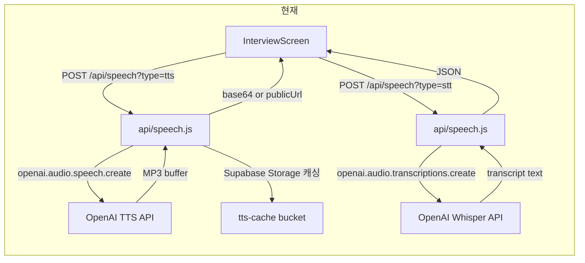
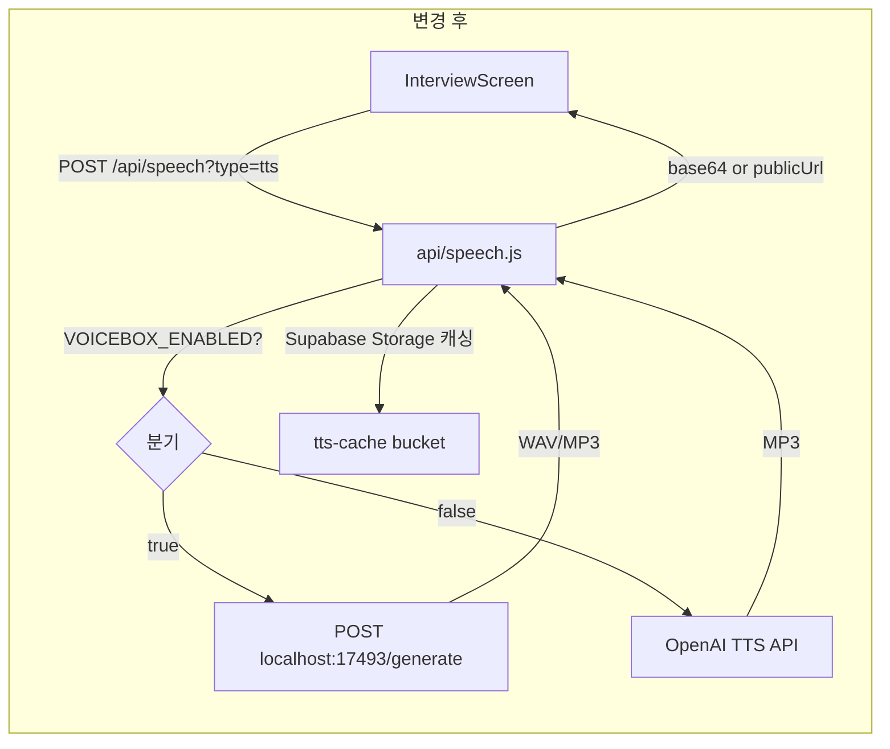
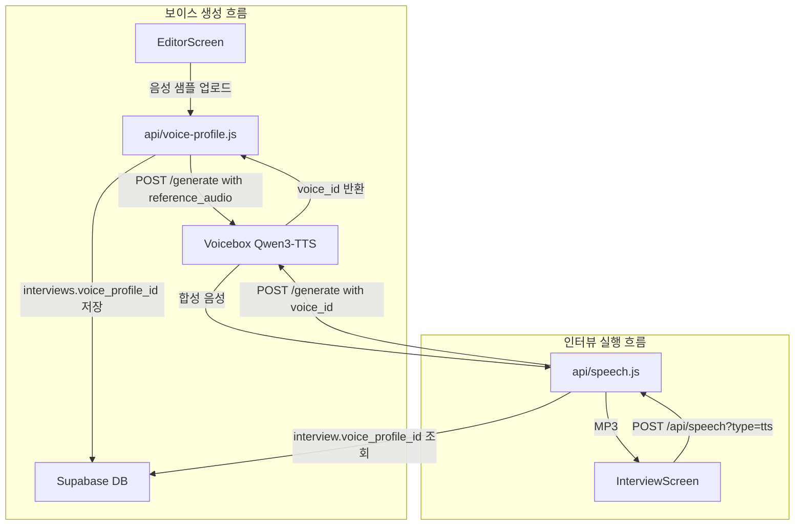
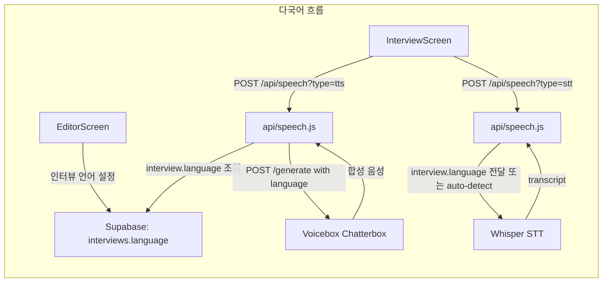
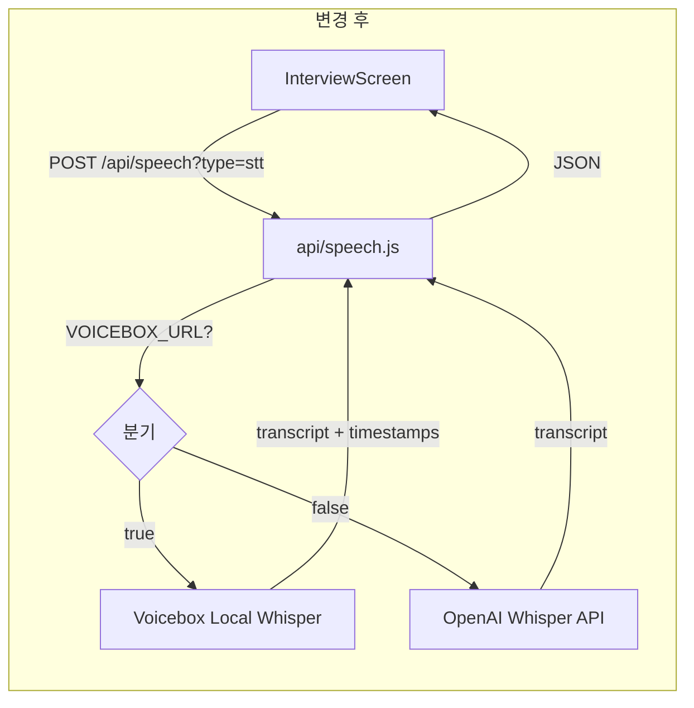
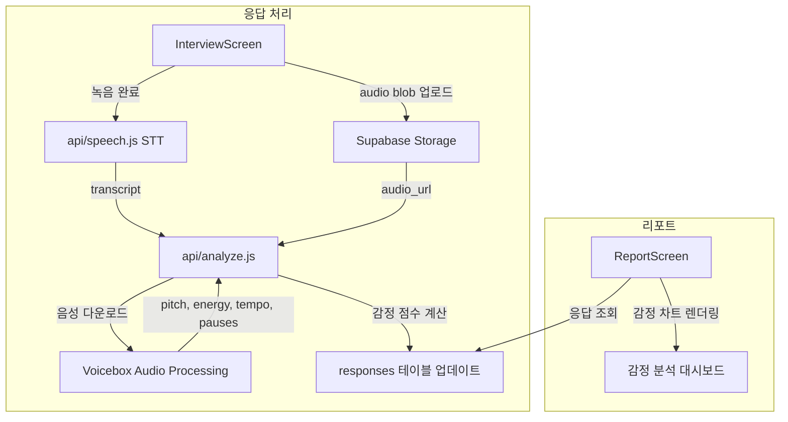

# Voicebox x Voica-v2 통합 시나리오

> Voicebox (오픈소스 Voice AI Studio)를 Voica-v2 (AI 음성 인터뷰 플랫폼)에 통합하는 5가지 구체적 시나리오

## 현재 아키텍처 요약

Voica-v2의 현재 음성 파이프라인:
- **TTS**: OpenAI `tts-1-hd` / `nova` voice → `api/speech.js` (`type=tts`)
- **STT**: OpenAI Whisper-1 → `api/speech.js` (`type=stt`, 한국어 고정)
- **Bridge phrases**: 5개 한국어 상투어 ("네, 감사해요.", "알겠습니다." 등) → TTS로 변환 후 질문 간 재생
- **캐싱**: question별 TTS를 Supabase Storage `tts-cache` 버킷에 MP3로 저장, `questions.tts_url` 컬럼에 URL 기록
- **프리페치**: 인터뷰 로드 시 모든 질문 TTS를 백그라운드 프리페치, 현재 답변 중 다음 질문 프리페치



---

## 시나리오 1: AI 인터뷰어 음성 합성 (TTS 엔진 교체)

### 개요
현재 OpenAI `tts-1-hd` / `nova` 보이스를 Voicebox의 TTS 엔진으로 교체하여, 더 자연스럽고 다양한 음성으로 질문을 읽어주는 AI 인터뷰어를 구현한다.

### 왜 중요한가
- OpenAI TTS는 per-request 과금 → Voicebox는 로컬 실행으로 **비용 제로**
- 현재 `nova` 단일 보이스 → Voicebox는 Kokoro, Qwen3-TTS, Chatterbox 등 7개 엔진에서 다양한 음색 선택 가능
- Bridge phrase ("네, 감사해요." 등)도 동일 보이스로 일관성 있는 톤 유지

### 사용하는 Voicebox 기능
- `POST /generate` — 텍스트 → 음성 합성
- Kokoro 엔진 (경량, 한국어 지원, 빠른 응답)
- Profile 관리 (인터뷰별 보이스 프로필 저장)

### 기술 통합 포인트



**`api/speech.js` 변경사항:**

```javascript
// 기존 OpenAI TTS 호출 부분을 분기 처리
if (process.env.VOICEBOX_URL) {
  const vbRes = await fetch(`${process.env.VOICEBOX_URL}/generate`, {
    method: "POST",
    headers: { "Content-Type": "application/json" },
    body: JSON.stringify({
      text,
      voice_id: process.env.VOICEBOX_VOICE_ID || "default",
      engine: "kokoro",
      output_format: "mp3",
    }),
  });
  const buffer = Buffer.from(await vbRes.arrayBuffer());
  // 이하 캐싱 로직 동일
}
```

**데이터 흐름:**
1. `InterviewScreen` → `prefetchTts()` / `playBridgeTts()` → `POST /api/speech?type=tts`
2. `api/speech.js` → `VOICEBOX_URL` 존재 시 Voicebox `/generate` 호출, 없으면 OpenAI fallback
3. 응답 MP3 → 기존 Supabase Storage 캐싱 로직 그대로 활용
4. Bridge phrase (question_id 없는 요청)도 동일 경로

### 사용자 경험 변화
- 인터뷰어 음성이 더 자연스럽고 한국어에 최적화된 톤으로 변경
- 질문과 bridge phrase가 동일한 보이스로 일관성 유지
- 로컬 실행으로 응답 속도 향상 (네트워크 latency 제거)

### 구현 복잡도: **Low**
- `api/speech.js`에 환경변수 분기 하나 추가
- 기존 캐싱/프리페치 로직 변경 없음
- 프론트엔드 변경 없음

---

## 시나리오 2: 맞춤형 인터뷰어 보이스 (Voice Cloning)

### 개요
연구자 또는 브랜드가 자신의 목소리 샘플을 업로드하여 커스텀 AI 인터뷰어 보이스를 생성한다. 예: 대표이사 목소리로 고객 인터뷰, 브랜드 캐릭터 목소리로 사용자 리서치.

### 왜 중요한가
- 참여자 신뢰도 향상: 익숙한 목소리 → 더 솔직한 답변
- 브랜드 일관성: 기업 인터뷰에서 브랜드 톤앤매너 유지
- 차별화: 경쟁 리서치 도구 대비 강력한 USP

### 사용하는 Voicebox 기능
- **Qwen3-TTS** — 수 초의 오디오 샘플에서 보이스 클로닝
- **Profile 관리** — 클로닝된 보이스를 프로필로 저장/재사용
- `POST /generate` with `voice_id` — 저장된 프로필로 합성

### 기술 통합 포인트



**새로운 API 엔드포인트: `api/voice-profile.js`**

- `POST` — 음성 샘플 업로드 → Voicebox에 프로필 생성 → `interviews` 테이블에 `voice_profile_id` 저장
- `GET` — 인터뷰의 현재 보이스 프로필 정보 조회
- `DELETE` — 프로필 삭제

**DB 변경:**
- `interviews` 테이블에 `voice_profile_id` 컬럼 추가 (nullable)

**프론트엔드 변경:**
- `EditorScreen`에 보이스 설정 섹션 추가
  - 음성 샘플 업로드 (최소 5초)
  - 미리 듣기 버튼
  - 프리셋 보이스 선택 옵션

### 사용자 경험 변화
- 연구자: EditorScreen에서 "인터뷰어 목소리" 섹션 → 샘플 녹음/업로드 → 미리 듣기 → 저장
- 참여자: 인터뷰 시작 시 커스텀 보이스로 질문 재생 (기존 UX와 동일, 목소리만 다름)

### 구현 복잡도: **Medium**
- 새 API 엔드포인트 1개
- DB 마이그레이션 1개
- EditorScreen UI 추가
- InterviewScreen 변경 없음 (api/speech.js가 voice_profile_id를 투명하게 처리)

---

## 시나리오 3: 다국어 음성 인터뷰

### 개요
현재 한국어 고정(`language: "ko"`)인 인터뷰를 23개 언어로 확장한다. Voicebox의 Chatterbox 엔진(23개 언어 지원)으로 TTS를, Whisper의 자동 언어 감지로 STT를 처리한다.

### 왜 중요한가
- 글로벌 리서치 수요: 해외 시장 조사, 다국적 기업 내부 리서치
- 한국어 외 언어 지원이 없는 현재 → 시장 확대 기회
- 인터뷰 생성 시 언어만 설정하면 TTS/STT가 자동 전환

### 사용하는 Voicebox 기능
- **Chatterbox 엔진** — 23개 언어 TTS 지원
- `POST /generate` with `language` parameter
- Whisper STT의 자동 언어 감지 (OpenAI API의 `language` 파라미터 제거)

### 기술 통합 포인트



**`api/speech.js` STT 변경:**

```javascript
// 기존: language: "ko" 고정
const transcription = await openai.audio.transcriptions.create({
  model: "whisper-1",
  file: await toFile(fileStream, "audio.webm", { type: "audio/webm" }),
  language: "ko",  // ← 이 부분을 동적으로
});

// 변경: interview의 language 설정 참조
const transcription = await openai.audio.transcriptions.create({
  model: "whisper-1",
  file: await toFile(fileStream, "audio.webm", { type: "audio/webm" }),
  ...(language !== "auto" && { language }),  // auto면 Whisper 자동 감지
});
```

**`api/speech.js` TTS 변경:**
- Voicebox `/generate` 호출 시 `language` 파라미터 전달
- 언어별 적합한 엔진 자동 선택 (한국어: Kokoro, 영어: Chatterbox 등)

**Bridge phrases 다국어화:**

```javascript
const BRIDGE_PHRASES = {
  ko: ["네, 감사해요.", "알겠습니다.", "말씀해 주셔서 감사해요.", ...],
  en: ["Thanks for that.", "I see.", "Thank you for sharing.", ...],
  ja: ["ありがとうございます。", "なるほど。", ...],
  // ... 23개 언어
};
```

**DB 변경:**
- `interviews` 테이블에 `language` 컬럼 추가 (default: `"ko"`)

### 사용자 경험 변화
- 연구자: 인터뷰 생성 시 "인터뷰 언어" 드롭다운 → 선택한 언어로 TTS/STT 자동 전환
- 참여자: 해당 언어로 자연스러운 음성 질문 + 해당 언어 음성 인식
- UI 텍스트(안내 문구)도 언어별 분기 필요

### 구현 복잡도: **High**
- TTS/STT 엔진 언어 매핑
- Bridge phrases 23개 언어 번역
- UI 텍스트 i18n (InterviewScreen, ConsentScreen 등)
- DB 마이그레이션
- 언어별 음성 품질 검증 필요

---

## 시나리오 4: 응답 음성 전사 강화 (로컬 Whisper STT)

### 개요
현재 OpenAI Whisper API를 사용하는 STT를 Voicebox의 로컬 Whisper로 대체/보완하여, 비용 절감 + 전사 정확도 향상 + 프라이버시 강화를 달성한다.

### 왜 중요한가
- **비용**: OpenAI Whisper API는 분당 $0.006 → 대규모 리서치(1000명 x 10문항 x 1분)에서 $60/리서치
- **프라이버시**: 민감한 인터뷰 음성이 외부 API로 전송되지 않음 (로컬 처리)
- **정확도**: 로컬 Whisper는 `large-v3` 모델 사용 가능 (OpenAI API는 모델 선택 불가)
- **오프라인**: 네트워크 없이도 전사 가능 (on-premise 배포 시)

### 사용하는 Voicebox 기능
- **Whisper STT** — 로컬 Whisper 모델로 음성 → 텍스트 전사
- 다양한 모델 크기 선택 (tiny → large-v3)
- 타임스탬프 포함 전사 (단어 레벨)

### 기술 통합 포인트



**`api/speech.js` STT 변경:**

```javascript
if (process.env.VOICEBOX_URL) {
  // Voicebox 로컬 Whisper 사용
  const formData = new FormData();
  formData.append("audio", fileStream, "audio.webm");
  const vbRes = await fetch(`${process.env.VOICEBOX_URL}/transcribe`, {
    method: "POST",
    body: formData,
  });
  const result = await vbRes.json();
  return res.status(200).json({
    transcript: result.text,
    timestamps: result.segments,  // 추가 데이터: 단어별 타임스탬프
  });
}
```

**추가 가치 — 단어 레벨 타임스탬프:**
- 로컬 Whisper는 단어별 타임스탬프를 제공
- `responses` 테이블에 `timestamps` JSONB 컬럼 추가
- ReportScreen에서 응답 음성 재생 시 해당 구간 하이라이트 가능

### 사용자 경험 변화
- 참여자: 변화 없음 (투명한 백엔드 교체)
- 연구자: ReportScreen에서 전사 텍스트 클릭 시 해당 음성 구간으로 이동 가능
- 관리자: API 비용 대폭 절감

### 구현 복잡도: **Low**
- `api/speech.js`에 환경변수 분기 추가 (시나리오 1과 동일 패턴)
- 프론트엔드 변경 없음 (timestamps 활용은 별도 후속 작업)
- 기존 OpenAI API를 fallback으로 유지

---

## 시나리오 5: 음성 감정 분석 연동

### 개요
참여자의 응답 음성에서 톤, 감정, 에너지 레벨을 분석하여 텍스트 전사와 함께 정량적 감정 데이터를 제공한다. 리서치 리포트에서 "뭐라고 했는가" + "어떤 감정으로 말했는가"를 함께 볼 수 있다.

### 왜 중요한가
- 음성 인터뷰의 핵심 장점: 텍스트 서베이로는 알 수 없는 감정/톤 포착
- "좋아요"라고 했지만 불만족한 톤 → 텍스트만으로는 놓치는 인사이트
- 정량적 감정 데이터로 응답 간 비교 분석 가능

### 사용하는 Voicebox 기능
- **오디오 후처리 파이프라인** — 음성 특성 추출
- Whisper 전사 + 음성 특성 분석 병렬 처리
- (향후) Voicebox에 감정 분석 모델 추가 시 직접 연동

### 기술 통합 포인트



**새로운 API 엔드포인트: `api/analyze.js`**

비동기 처리 (응답 저장 후 백그라운드에서 분석):

```javascript
// 1. 음성 파일에서 특성 추출
const features = await fetch(`${VOICEBOX_URL}/analyze`, {
  method: "POST",
  body: audioFormData,
});

// 2. 감정 점수 계산
const sentiment = {
  valence: features.pitch_variance > threshold ? "positive" : "neutral",
  energy: features.rms_energy,
  speech_rate: features.words_per_minute,
  pause_ratio: features.silence_ratio,
  confidence: features.confidence_score,
};

// 3. DB 저장
await supabase.from("responses")
  .update({ voice_sentiment: sentiment })
  .eq("id", responseId);
```

**DB 변경:**
- `responses` 테이블에 `voice_sentiment` JSONB 컬럼 추가

**ReportScreen 변경:**
- 응답 카드에 감정 인디케이터 추가 (에너지 바, 톤 태그)
- 전체 응답 감정 분포 차트 (긍정/중립/부정 비율)
- 질문별 평균 감정 점수 비교

### 사용자 경험 변화
- 참여자: 변화 없음
- 연구자: ReportScreen에서 각 응답 옆에 감정 태그(열정적/중립/소극적) 표시
- 리포트: "Q3에서 참여자의 72%가 높은 에너지로 답변 → 이 주제에 강한 관심" 같은 인사이트 도출

### 구현 복잡도: **High**
- Voicebox에 음성 분석 API 필요 (현재 미제공 → 커스텀 구현 또는 별도 모델 통합)
- 비동기 처리 파이프라인 구축
- ReportScreen UI 확장
- 감정 분석 모델의 정확도 검증 필요
- DB 마이그레이션

---

## 통합 우선순위 매트릭스

| 시나리오 | 복잡도 | 비용 절감 | 사용자 가치 | 차별화 | 권장 순서 |
|---------|--------|----------|------------|--------|----------|
| 1. TTS 엔진 교체 | Low | High | Medium | Low | **1순위** |
| 4. 로컬 Whisper STT | Low | High | Low | Low | **2순위** |
| 2. Voice Cloning | Medium | - | High | High | **3순위** |
| 3. 다국어 인터뷰 | High | - | High | Medium | **4순위** |
| 5. 감정 분석 | High | - | Very High | Very High | **5순위** |

### 권장 접근법

**Phase 1 (1-2주):** 시나리오 1 + 4 동시 진행
- `api/speech.js`에 `VOICEBOX_URL` 환경변수 분기 추가
- TTS와 STT 모두 로컬 Voicebox로 전환
- OpenAI API를 fallback으로 유지
- 프론트엔드 변경 없음

**Phase 2 (2-3주):** 시나리오 2
- Voice cloning으로 프리미엄 기능 차별화
- EditorScreen에 보이스 설정 UI 추가

**Phase 3 (4-6주):** 시나리오 3
- 다국어 지원으로 시장 확대
- i18n 인프라 구축

**Phase 4 (6-8주):** 시나리오 5
- 감정 분석으로 리서치 인사이트 품질 도약
- 데이터 사이언스 역량 필요
