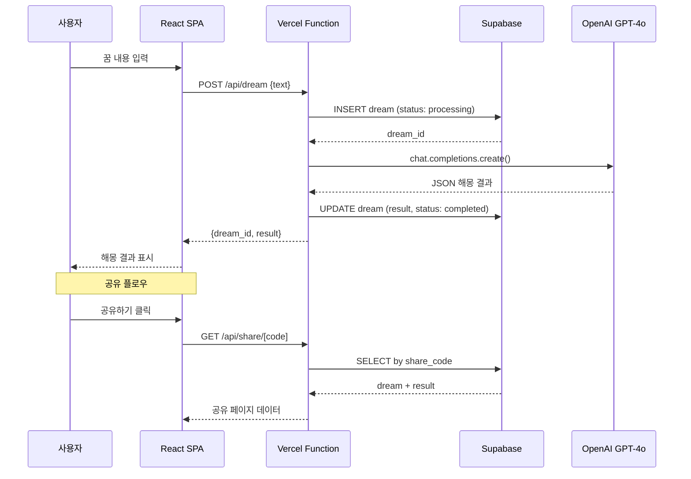

# 성경 기반 꿈 해몽 AI 서비스 - 기술 아키텍처

> 작성일: 2026-04-15
> 대상: 인디 개발자 1인 MVP 개발

---

## 목차

1. [기존 스택 분석](#1-기존-스택-분석)
2. [AI/LLM 설계](#2-aillm-설계)
3. [MVP 아키텍처](#3-mvp-아키텍처)
4. [기술 스택](#4-기술-스택)
5. [데이터 모델](#5-데이터-모델)
6. [API 엔드포인트](#6-api-엔드포인트)
7. [핵심 기능 설계](#7-핵심-기능-설계)
8. [확장성 로드맵](#8-확장성-로드맵)
9. [비용 추정](#9-비용-추정)

---

## 1. 기존 스택 분석

voica-v2 프로젝트의 기존 기술 스택을 그대로 활용 가능:

| 영역 | 기술 | 비고 |
|------|------|------|
| 프론트엔드 | React 18 + Vite 6 | JSX 기반, TypeScript 미사용 |
| 라우팅 | react-router-dom v7 | SPA 라우팅 |
| 백엔드 | Vercel Serverless Functions | `api/` 디렉토리 기반 |
| 데이터베이스 | Supabase (PostgreSQL) | RLS 기반 보안 |
| AI | OpenAI SDK (gpt-4o) | 이미 프로젝트에 설치됨 |
| 배포 | Vercel | 자동 배포 |

**핵심 판단:** 기존 스택을 100% 재활용한다. 새로운 기술 도입 없이 MVP 구축 가능.

---

## 2. AI/LLM 설계

### 2.1 모델 선택

| 모델 | 장점 | 단점 | 추천 |
|------|------|------|------|
| **GPT-4o** | 기존 SDK 설치됨, 한국어 우수, JSON mode 지원 | 토큰당 비용 높음 | **MVP 1순위** |
| GPT-4o-mini | 저비용, 빠른 응답 | 해석 품질 다소 낮음 | 비용 절감 시 전환 |
| Claude 3.5 Sonnet | 긴 컨텍스트, 정교한 한국어 | SDK 추가 필요 | 향후 A/B 테스트 |

**결정: GPT-4o → GPT-4o-mini 2단계 전략**
- MVP 초기: GPT-4o로 품질 검증
- 트래픽 증가 시: 단순 해몽은 GPT-4o-mini, 심층 해몽은 GPT-4o

### 2.2 프롬프트 엔지니어링 전략

```
[시스템 프롬프트 구조]

역할 설정:
  "당신은 성경에 깊은 지식을 가진 기독교 꿈 해몽 상담사입니다."

지침:
  1. 꿈의 핵심 상징(symbols)을 추출한다
  2. 각 상징에 대응하는 성경 구절을 찾는다
  3. 성경적 맥락에서 꿈의 의미를 해석한다
  4. 위로와 격려의 메시지로 마무리한다

제약:
  - 반드시 성경 구절을 최소 2개 이상 인용
  - 미신적/점술적 해석 금지
  - 의학적/심리학적 진단 금지
  - 부정적 해석도 희망적 관점으로 전환

출력 형식: JSON
```

**구체적 시스템 프롬프트:**

```javascript
const SYSTEM_PROMPT = `당신은 성경에 깊은 지식을 가진 기독교 꿈 해몽 상담사입니다.

## 역할
사용자가 꾼 꿈을 성경적 관점에서 해석하여 영적 위로와 지혜를 제공합니다.

## 해석 프로세스
1. 꿈에서 핵심 상징(symbol)을 2-5개 추출
2. 각 상징에 대응하는 성경 구절과 맥락을 연결
3. 종합적인 성경적 해석을 제공
4. 기도 제목 또는 묵상 포인트를 제안

## 규칙
- 반드시 성경 구절을 2개 이상 정확히 인용 (책명 장:절)
- 점술/미신적 해석 금지. 오직 성경적 해석만 제공
- 의학적/심리학적 진단 금지
- 부정적 꿈도 하나님의 보호와 경고의 관점에서 해석
- 한국어로 답변

## 출력 JSON 형식
{
  "symbols": [
    { "name": "상징명", "bible_ref": "성경구절 (책 장:절)", "meaning": "성경적 의미" }
  ],
  "interpretation": "종합 해석 (3-5문장)",
  "bible_verses": [
    { "ref": "책 장:절", "text": "구절 본문", "relevance": "이 꿈과의 연관성" }
  ],
  "prayer_point": "기도 제목 또는 묵상 포인트",
  "encouragement": "위로와 격려의 한마디"
}`;
```

### 2.3 RAG (성경 구절 DB) 설계

**MVP 단계에서는 RAG 없이 시작한다.**

이유:
- GPT-4o는 이미 성경 전문을 학습 데이터에 포함
- 프롬프트에서 "정확한 구절 인용" 지시만으로 충분한 품질
- RAG 구축은 복잡도 대비 초기 ROI 낮음

**향후 RAG 도입 시나리오 (v2):**

```
성경 구절 DB (Supabase pgvector)
  ├── 꿈 관련 키워드 임베딩
  ├── 성경 구절 텍스트 + 임베딩
  └── 상징-구절 매핑 테이블

Flow:
  사용자 꿈 입력 → 키워드 추출 → 벡터 검색 → 관련 구절 Top-5
  → 프롬프트에 구절 삽입 → LLM 해석
```

---

## 3. MVP 아키텍처

### 3.1 시스템 아키텍처 다이어그램

```
┌─────────────────────────────────────────────────────┐
│                    사용자 (모바일/PC)                  │
└──────────────────────┬──────────────────────────────┘
                       │ HTTPS
                       ▼
┌─────────────────────────────────────────────────────┐
│                 Vercel Edge Network                   │
│  ┌───────────────┐  ┌────────────────────────────┐  │
│  │  React SPA    │  │  Serverless Functions       │  │
│  │  (Vite 빌드)  │  │  /api/dream    POST        │  │
│  │               │  │  /api/dream/[id] GET        │  │
│  │  - 꿈 입력 폼  │  │  /api/dreams   GET (목록)   │  │
│  │  - 해몽 결과   │  │  /api/share/[code] GET     │  │
│  │  - 꿈 일기    │  │                            │  │
│  │  - 공유 페이지 │  │                            │  │
│  └───────────────┘  └─────────┬──────────────────┘  │
└─────────────────────────────────┬────────────────────┘
                                  │
                    ┌─────────────┼─────────────┐
                    ▼             ▼             ▼
             ┌───────────┐ ┌───────────┐ ┌──────────┐
             │ Supabase  │ │ OpenAI    │ │ Supabase │
             │ PostgreSQL│ │ GPT-4o    │ │ Auth     │
             │           │ │ API       │ │          │
             │ - dreams  │ │           │ │ - 소셜   │
             │ - results │ │           │ │   로그인  │
             │ - users   │ │           │ │ - 익명   │
             └───────────┘ └───────────┘ └──────────┘
```

### 3.2 요청 흐름 (핵심 플로우)

```
[꿈 해몽 요청 Flow]

사용자 → 꿈 텍스트 입력 (200자 이상 권장)
  │
  ▼
POST /api/dream
  │
  ├── 1. 입력 검증 (최소 10자, 최대 2000자)
  ├── 2. Supabase에 dream 레코드 생성 (status: 'processing')
  ├── 3. OpenAI API 호출 (시스템 프롬프트 + 꿈 텍스트)
  ├── 4. JSON 응답 파싱 및 검증
  ├── 5. Supabase에 결과 저장 (status: 'completed')
  └── 6. 결과 반환 → 프론트엔드 렌더링

예상 응답 시간: 3-8초 (GPT-4o 기준)
```

### 3.3 Mermaid 시퀀스 다이어그램



---

## 4. 기술 스택

### 4.1 확정 스택 (기존 프로젝트 동일)

```
프론트엔드:
  - React 18.3 + Vite 6.3
  - react-router-dom 7
  - 순수 CSS (별도 UI 라이브러리 없음)

백엔드:
  - Vercel Serverless Functions (Node.js)
  - export default handler(req, res) 패턴

데이터베이스:
  - Supabase PostgreSQL
  - Supabase Auth (소셜 로그인)
  - RLS (Row Level Security) 기반 보안

AI:
  - OpenAI SDK (openai 패키지, 이미 설치됨)
  - GPT-4o (JSON mode)

인프라:
  - Vercel (호스팅 + 서버리스)
  - Supabase (DB + Auth + Storage)
```

### 4.2 추가 패키지 (최소한)

```json
{
  "추가 불필요": "기존 package.json의 의존성만으로 MVP 구현 가능",
  "선택적 추가": {
    "react-markdown": "해몽 결과 마크다운 렌더링 (선택)",
    "date-fns": "꿈 일기 날짜 포맷팅 (선택)"
  }
}
```

---

## 5. 데이터 모델

### 5.1 ERD (ASCII)

```
┌──────────────┐     ┌──────────────────┐     ┌──────────────────┐
│   profiles   │     │     dreams       │     │  dream_results   │
├──────────────┤     ├──────────────────┤     ├──────────────────┤
│ id (PK, FK)  │────<│ id (PK)          │────<│ id (PK)          │
│ nickname     │     │ user_id (FK)     │     │ dream_id (FK)    │
│ created_at   │     │ content (text)   │     │ symbols (jsonb)  │
└──────────────┘     │ share_code       │     │ interpretation   │
                     │ status           │     │ bible_verses     │
                     │ is_public        │     │ prayer_point     │
                     │ created_at       │     │ encouragement    │
                     └──────────────────┘     │ model_used       │
                                              │ tokens_used      │
                                              │ created_at       │
                                              └──────────────────┘
```

### 5.2 SQL 마이그레이션

```sql
-- 001_bible_dream_init.sql

-- 사용자 프로필 (Supabase Auth 연동)
create table profiles (
  id uuid primary key references auth.users(id) on delete cascade,
  nickname text,
  created_at timestamptz default now()
);

-- 꿈 기록
create table dreams (
  id uuid primary key default gen_random_uuid(),
  user_id uuid references auth.users(id) on delete cascade,
  content text not null,
  share_code text unique default encode(gen_random_bytes(6), 'hex'),
  status text not null default 'pending'
    check (status in ('pending', 'processing', 'completed', 'failed')),
  is_public boolean default false,
  created_at timestamptz default now()
);

-- 해몽 결과
create table dream_results (
  id uuid primary key default gen_random_uuid(),
  dream_id uuid references dreams(id) on delete cascade not null unique,
  symbols jsonb not null default '[]',
  interpretation text not null,
  bible_verses jsonb not null default '[]',
  prayer_point text,
  encouragement text,
  model_used text default 'gpt-4o',
  tokens_used int,
  created_at timestamptz default now()
);

-- 인덱스
create index idx_dreams_user_id on dreams(user_id);
create index idx_dreams_share_code on dreams(share_code);
create index idx_dreams_created_at on dreams(created_at desc);
create index idx_dream_results_dream_id on dream_results(dream_id);

-- RLS 정책
alter table profiles enable row level security;
alter table dreams enable row level security;
alter table dream_results enable row level security;

-- profiles: 본인만 읽기/수정
create policy "own_profile" on profiles
  for all using (auth.uid() = id);

-- dreams: 본인 꿈 전체 접근 + 공개 꿈 읽기
create policy "own_dreams" on dreams
  for all using (auth.uid() = user_id);
create policy "public_dreams_read" on dreams
  for select using (is_public = true);

-- 익명 사용자 (user_id IS NULL)도 꿈 생성 가능
create policy "anon_create_dream" on dreams
  for insert with check (user_id is null);

-- dream_results: 꿈 소유자 또는 공개 꿈의 결과 읽기
create policy "own_results" on dream_results
  for all using (
    exists (
      select 1 from dreams
      where dreams.id = dream_results.dream_id
      and dreams.user_id = auth.uid()
    )
  );
create policy "public_results_read" on dream_results
  for select using (
    exists (
      select 1 from dreams
      where dreams.id = dream_results.dream_id
      and dreams.is_public = true
    )
  );

-- share_code로 접근 시 결과 읽기 (서버사이드에서 service_role로 처리)
```

### 5.3 JSONB 필드 상세 스키마

```javascript
// symbols 필드
[
  {
    "name": "물",           // 상징 이름
    "bible_ref": "요한복음 4:14",  // 관련 성경 구절
    "meaning": "영적 갈증과 생수"   // 성경적 의미
  }
]

// bible_verses 필드
[
  {
    "ref": "시편 23:2",
    "text": "그가 나를 푸른 초장에 누이시며 쉴 만한 물가로 인도하시는도다",
    "relevance": "꿈에서 본 평화로운 물가는 하나님의 인도하심을 상징"
  }
]
```

---

## 6. API 엔드포인트

### 6.1 엔드포인트 목록

| 메서드 | 경로 | 인증 | 설명 |
|--------|------|------|------|
| `POST` | `/api/dream` | 선택 | 꿈 해몽 요청 (익명 가능) |
| `GET` | `/api/dream/[id]` | 필수 | 내 해몽 결과 조회 |
| `GET` | `/api/dreams` | 필수 | 내 꿈 목록 (페이지네이션) |
| `GET` | `/api/share/[code]` | 없음 | 공유 링크로 결과 조회 |
| `DELETE` | `/api/dream/[id]` | 필수 | 꿈 기록 삭제 |

### 6.2 핵심 API 구현 (POST /api/dream)

```javascript
// api/dream.js
import { createClient } from "@supabase/supabase-js";
import OpenAI from "openai";

const supabase = createClient(
  process.env.VITE_SUPABASE_URL,
  process.env.SUPABASE_SERVICE_ROLE_KEY
);
const openai = new OpenAI({ apiKey: process.env.OPENAI_API_KEY });

const SYSTEM_PROMPT = `당신은 성경에 깊은 지식을 가진 기독교 꿈 해몽 상담사입니다.
... (2.2절의 전체 프롬프트)`;

export default async function handler(req, res) {
  if (req.method !== "POST")
    return res.status(405).json({ error: "Method not allowed" });

  const { content } = req.body;

  // 입력 검증
  if (!content || content.length < 10)
    return res.status(400).json({ error: "꿈 내용을 10자 이상 입력해주세요" });
  if (content.length > 2000)
    return res.status(400).json({ error: "2000자 이내로 입력해주세요" });

  // 선택적 인증 (로그인 사용자는 기록 저장)
  let userId = null;
  const token = req.headers.authorization?.replace("Bearer ", "");
  if (token) {
    const { data: { user } } = await supabase.auth.getUser(token);
    userId = user?.id ?? null;
  }

  // 꿈 레코드 생성
  const { data: dream, error: dreamErr } = await supabase
    .from("dreams")
    .insert({ user_id: userId, content, status: "processing" })
    .select()
    .single();
  if (dreamErr) return res.status(500).json({ error: dreamErr.message });

  try {
    // OpenAI 호출
    const completion = await openai.chat.completions.create({
      model: "gpt-4o",
      messages: [
        { role: "system", content: SYSTEM_PROMPT },
        { role: "user", content: `다음 꿈을 성경적으로 해석해주세요:\n\n${content}` }
      ],
      response_format: { type: "json_object" },
      temperature: 0.7,
      max_tokens: 1500,
    });

    const raw = completion.choices[0]?.message?.content;
    if (!raw) throw new Error("빈 응답");
    const result = JSON.parse(raw);

    // 결과 저장
    await supabase.from("dream_results").insert({
      dream_id: dream.id,
      symbols: result.symbols,
      interpretation: result.interpretation,
      bible_verses: result.bible_verses,
      prayer_point: result.prayer_point,
      encouragement: result.encouragement,
      tokens_used: completion.usage?.total_tokens,
    });

    await supabase.from("dreams")
      .update({ status: "completed" })
      .eq("id", dream.id);

    return res.status(200).json({
      dream_id: dream.id,
      share_code: dream.share_code,
      result,
    });
  } catch (e) {
    await supabase.from("dreams")
      .update({ status: "failed" })
      .eq("id", dream.id);
    return res.status(500).json({ error: e.message });
  }
}
```

---

## 7. 핵심 기능 설계

### 7.1 화면 구성 (라우트)

```javascript
// src/lib/routes.js에 추가할 라우트
const routes = [
  { path: "/",           screen: "LandingScreen" },      // 랜딩
  { path: "/dream",      screen: "DreamInputScreen" },    // 꿈 입력
  { path: "/dream/:id",  screen: "DreamResultScreen" },   // 해몽 결과
  { path: "/dreams",     screen: "DreamListScreen" },     // 내 꿈 일기
  { path: "/s/:code",    screen: "SharedDreamScreen" },   // 공유 페이지
  { path: "/auth",       screen: "AuthScreen" },          // 로그인
];
```

### 7.2 꿈 입력 UI 설계

```
┌─────────────────────────────────┐
│  ✝️ 성경 꿈 해몽                  │
│                                 │
│  어젯밤 어떤 꿈을 꾸셨나요?       │
│  ┌─────────────────────────┐    │
│  │                         │    │
│  │  (텍스트 입력 영역)       │    │
│  │  최대한 자세히 적어주세요  │    │
│  │                         │    │
│  │                         │    │
│  └─────────────────────────┘    │
│                    128 / 2000자  │
│                                 │
│  💡 꿈에서 본 장소, 사람, 감정을  │
│     구체적으로 적으면 더 정확한   │
│     해몽을 받을 수 있어요        │
│                                 │
│  ┌─────────────────────────┐    │
│  │    🙏 성경으로 해몽하기    │    │
│  └─────────────────────────┘    │
│                                 │
│  로그인하면 꿈 일기를 저장할 수   │
│  있어요 → 로그인               │
└─────────────────────────────────┘
```

### 7.3 해몽 결과 화면 구조

```
┌─────────────────────────────────┐
│  ← 뒤로    해몽 결과    공유 🔗  │
├─────────────────────────────────┤
│                                 │
│  📖 종합 해석                    │
│  ─────────────────────          │
│  {interpretation 텍스트}         │
│                                 │
│  🔮 꿈 속 상징                   │
│  ┌─────────────────────────┐    │
│  │ 물 → 요한복음 4:14       │    │
│  │ "영적 갈증과 생수"        │    │
│  ├─────────────────────────┤    │
│  │ 산 → 시편 121:1          │    │
│  │ "하나님의 보호와 도움"     │    │
│  └─────────────────────────┘    │
│                                 │
│  📜 관련 성경 구절               │
│  ┌─────────────────────────┐    │
│  │ 시편 23:2                │    │
│  │ "그가 나를 푸른 초장에..." │    │
│  │ → 꿈의 평화로운 장면과    │    │
│  │   하나님의 인도하심 연결   │    │
│  └─────────────────────────┘    │
│                                 │
│  🙏 기도 제목                    │
│  {prayer_point 텍스트}           │
│                                 │
│  💝 오늘의 격려                  │
│  {encouragement 텍스트}          │
│                                 │
│  ┌──────────┐ ┌──────────┐     │
│  │ 공유하기  │ │ 저장하기  │     │
│  └──────────┘ └──────────┘     │
└─────────────────────────────────┘
```

### 7.4 공유 기능

```
공유 URL 형식: https://dream.example.com/s/{share_code}

공유 방식:
  1. 카카오톡 공유 (메타 태그 기반 OG 미리보기)
  2. URL 복사
  3. 트위터/X 공유

OG 메타 태그:
  <meta property="og:title" content="성경 꿈 해몽 결과" />
  <meta property="og:description" content="{interpretation 앞 100자}..." />
  <meta property="og:image" content="/og-dream.png" />
```

---

## 8. 확장성 로드맵

### Phase 1: MVP (2-3주)

```
✅ 꿈 텍스트 입력 → AI 해몽
✅ 성경 구절 인용 결과
✅ 공유 링크 생성
✅ 익명 사용 가능
✅ 선택적 로그인 (꿈 일기 저장)
```

### Phase 2: 성장 (1-2개월 후)

```
📋 꿈 일기 타임라인
📋 반복되는 꿈 패턴 분석 (동일 상징 추적)
📋 카카오 로그인 추가
📋 SEO 최적화 (꿈 상징 사전 페이지)
📋 PWA (모바일 앱처럼 설치)
```

### Phase 3: 커뮤니티 (3-6개월 후)

```
📋 공개 꿈 갤러리 (익명)
📋 비슷한 꿈 추천 ("이런 꿈도 있었어요")
📋 목사님/상담사 상담 연결 (예약 시스템)
📋 꿈 통계 대시보드
📋 구독 모델 (월 무제한 해몽)
```

### Phase 4: 수익화 (6개월 이후)

```
📋 프리미엄 심층 해몽 (더 긴 분석, 맞춤 기도문)
📋 교회 단체 구독
📋 꿈 해몽 책 PDF 생성 (나만의 꿈 해몽 모음집)
📋 광고 (기독교 관련 광고만)
```

---

## 9. 비용 추정

### 9.1 MVP 단계 (일일 100건 해몽 기준)

| 항목 | 단가 | 월간 사용량 | 월 비용 |
|------|------|------------|---------|
| **Vercel** (Hobby) | 무료 | - | **$0** |
| **Supabase** (Free) | 무료 | 500MB DB | **$0** |
| **GPT-4o API** | ~$5/1M input + $15/1M output | 3,000건 × ~1500 토큰 | **~$15-25** |
| **도메인** | 연 $12 | - | **~$1** |
| **합계** | | | **~$16-26/월** |

### 9.2 비용 최적화 전략

```
1단계: 익명 사용자 일일 해몽 횟수 제한 (3회/일)
  → IP 기반 rate limiting (Vercel Edge Config)

2단계: 결과 캐싱
  → 동일/유사 꿈 내용 해시 → 캐시 히트 시 API 호출 생략
  → 예상 절감: 15-20%

3단계: 모델 다운그레이드
  → 단순 꿈: GPT-4o-mini ($0.15/1M input)
  → 복잡한 꿈: GPT-4o
  → 예상 절감: 50-60%

4단계: 프리미엄 과금
  → 무료: 일 3회 (GPT-4o-mini)
  → 구독 $4.99/월: 무제한 (GPT-4o)
```

### 9.3 성장 단계 비용 추정 (일일 1,000건)

| 항목 | 월 비용 |
|------|---------|
| Vercel Pro | $20 |
| Supabase Pro | $25 |
| GPT-4o API (30K건) | ~$150-250 |
| **합계** | **~$195-295/월** |

---

## 부록: 빠른 시작 가이드

### 1. 프로젝트 구조

```
voica-v2/
├── api/
│   ├── dream.js              # POST: 꿈 해몽 요청
│   ├── dream/[id].js         # GET: 결과 조회, DELETE: 삭제
│   ├── dreams.js             # GET: 내 꿈 목록
│   └── share/[code].js       # GET: 공유 링크 조회
├── src/
│   ├── screens/
│   │   ├── DreamInputScreen.jsx
│   │   ├── DreamResultScreen.jsx
│   │   ├── DreamListScreen.jsx
│   │   └── SharedDreamScreen.jsx
│   └── ...
└── supabase/
    └── migrations/
        └── 00X_bible_dream_init.sql
```

### 2. 환경 변수

```env
# 기존 변수 (이미 설정됨)
VITE_SUPABASE_URL=...
VITE_SUPABASE_ANON_KEY=...
SUPABASE_SERVICE_ROLE_KEY=...
OPENAI_API_KEY=...

# 추가 변수 없음 - 기존 환경 변수만으로 충분
```

### 3. MVP 구현 순서

```
Day 1-2: DB 마이그레이션 + POST /api/dream 구현
Day 3-4: DreamInputScreen + DreamResultScreen UI
Day 5:   꿈 목록 + 공유 기능
Day 6-7: 프롬프트 튜닝 + 테스트 + 배포
```

---

*이 문서는 voica-v2 프로젝트의 기존 기술 스택(React+Vite, Supabase, Vercel, OpenAI)을 기반으로 작성되었습니다. 새로운 기술 도입 없이 MVP 구축이 가능하도록 설계하였습니다.*
